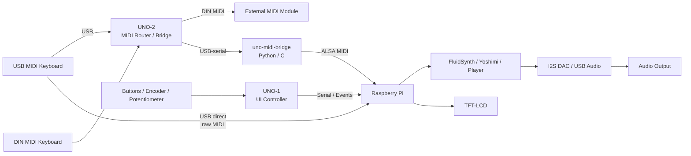

# Fluid Ardule

A DIY Raspberry Pi and Arduino-based MIDI sound module system that supports instant keyboard playback, General MIDI synthesis (FluidSynth), real-time synthesis (Yoshimi), and audio file playback in a single integrated platform.

Fluid Ardule combines software synthesis, hardware control, and MIDI routing into a compact, flexible, custom-built instrument platform.

---

## 🎬 Demo

---

## What does it do?

- Act as a standalone General MIDI (GM) sound module — connect a keyboard and play instantly
- Accept MIDI input from USB or DIN (DIN I/O via UNO-2 MIDI bridge)
- Play MIDI files and perform real-time synthesis using FluidSynth or Yoshimi
- Play audio files (MP3, OGG, WAV, WMA, and other common formats)
- Control parameters via hardware UI (UNO-1)
- Output audio via I2S DAC or USB DAC

---

## System Architecture

The system is designed as a modular architecture separating UI control, MIDI routing, and synthesis engine for flexibility and scalability.

→ See [architecture.md](architecture.md) for details.

---

## System Overview

- **Raspberry Pi**: synthesis engine (FluidSynth, Yoshimi), playback, control, I²S DAC, USB-UART, TFT display  
- **UNO-1**: UI controller (buttons, encoder, potentiometer, LEDs)  
- **UNO-2**: MIDI router / bridge (USB ↔ DIN), optional if using USB MIDI keyboard  

UNO-2 (Uno MIDI Bridge) is maintained as a separate project due to its strong independence.

---

## Hardware Layout

See the full wiring diagram for detailed connections.

---

## Related Projects

- [Nano Ardule](https://github.com/jeong0449/NanoArdule)
- [uno-midi-bridge](https://github.com/jeong0449/uno-midi-bridge)

---

## Status

🚧 Work in progress  

This repository documents the evolving system architecture and integration of related components.
