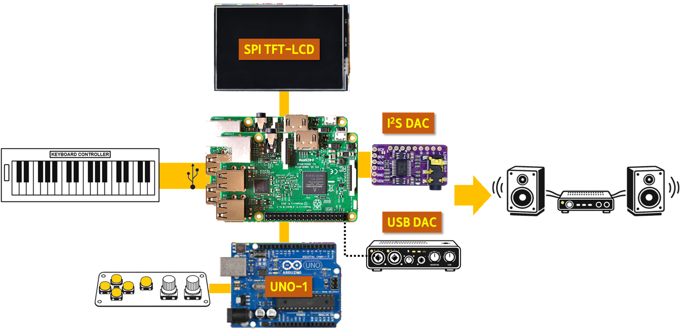
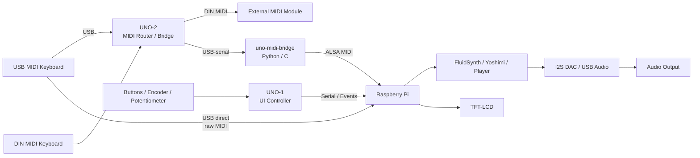
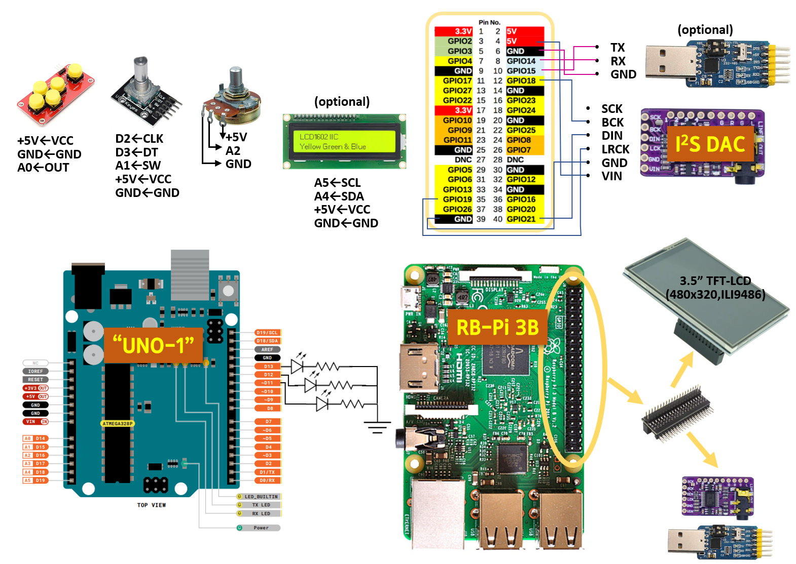

# Fluid Ardule

**Turn a Raspberry Pi and Arduino into a powerful standalone MIDI sound module.**

A modular DIY MIDI sound module combining Raspberry Pi synthesis with Arduino-based hardware control.

---

## What does it do?

- Act as a standalone MIDI sound module with instant playability — connect a keyboard and play immediately (supporting FluidSynth and planned real-time synthesis via Yoshimi)
- Control parameters via dedicated hardware UI (UNO-1)
- Accept MIDI input from USB or DIN (DIN I/O via UNO-2 MIDI bridge)
- Play MIDI files using FluidSynth
- Play audio files (MP3, OGG, WAV, WMA, and other common formats)
- Output audio via I2S DAC or USB DAC

> 🚧 Advanced performance features such as preset editing, user preset management, layering, combination patches, and keyboard split are not yet implemented and are planned for future development.

---

## System Overview

- **Raspberry Pi**: core system (synthesis, playback, control)
- **TFT-LCD**: dedicated UI display driven by the Python application (not a general-purpose system display)
- **UNO-1**: UI controller (buttons, encoder, potentiometer, LEDs)
- **UNO-2**: MIDI bridge for devices with 5-pin DIN only (keyboard controllers or external sound modules)

[UNO-2](https://github.com/jeong0449/NanoArdule/tree/main/firmware/ardule_usb_midi_host) (`Ardule` MIDI Bridge or USB MIDI Host) is maintained as a separate project due to its strong independence, and is therefore omitted from the diagram above.

---

## 🎬 Demo

---

## System Architecture

The system is designed as a modular architecture separating UI control, MIDI routing, and synthesis engine for flexibility and scalability.

→ See [architecture.md](architecture.md) for details.

---

## Hardware Layout

Click the diagram to enlarge.  
See [components.md](docs/components.md) for the parts list.

---

## Performance Notes

### Real-time Safe UI Rendering

To ensure stable real-time MIDI performance, TFT rendering is designed to minimize interference with audio processing.

- User-triggered updates (buttons, encoder) are rendered immediately
- Background screen updates are rate-limited (`RENDER_MIN_INTERVAL`)

This prevents frequent framebuffer updates from disrupting FluidSynth timing,
especially on resource-constrained systems like Raspberry Pi 3.

As a result:

- Audio glitches during live MIDI playback are significantly reduced
- Both `alsa_raw` and `alsa_seq` modes benefit from improved stability
- UI remains responsive when user interaction occurs

This approach aligns with dedicated hardware synthesizers, where display updates are deprioritized during active performance.

---

## Installation / Build

🚧 Work in progress  

An installation guide for OS and software setup is currently being prepared.  
Hardware assembly can be inferred from the system overview and components documentation.

👉 [Installation Guide](docs/installation.md)

---

## Related Projects

- [Nano Ardule](https://github.com/jeong0449/NanoArdule)
- [Ardule USB MIDI Host (UNO-2)](https://github.com/jeong0449/NanoArdule/tree/main/firmware/ardule_usb_midi_host)
- [uno-midi-bridge](https://github.com/jeong0449/uno-midi-bridge)

---

## Status

🚧 Work in progress  

This repository documents the evolving system architecture and integration of related components.

---

## Naming

**Fluid Ardule** is a compound name combining:

- **Fluid** — referring to FluidSynth, the software synthesizer used in the system 
- **Ardule** — a coined term derived from *Arduino* and *module*, representing a modular Arduino-based hardware system  

Together, *Fluid Ardule* describes a hybrid MIDI sound module that integrates software synthesis with Arduino-based hardware control.

The name *Fluid Ardule* was chosen after considering alternatives such as *Fluid Canvas,* which was already in use.
