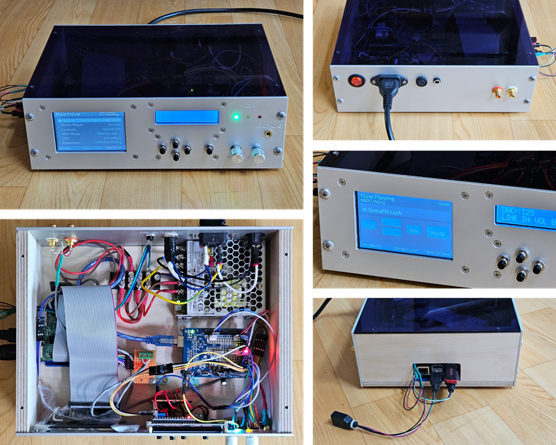
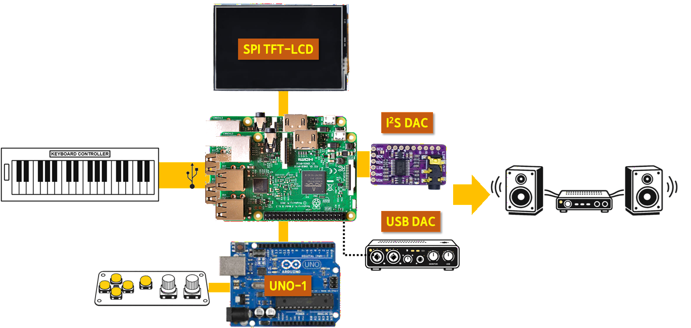
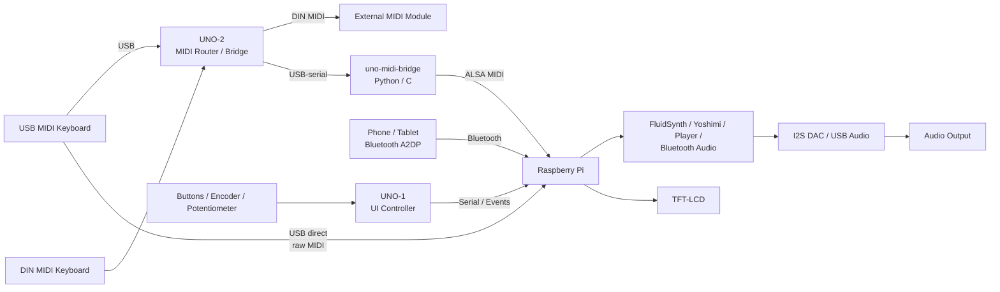
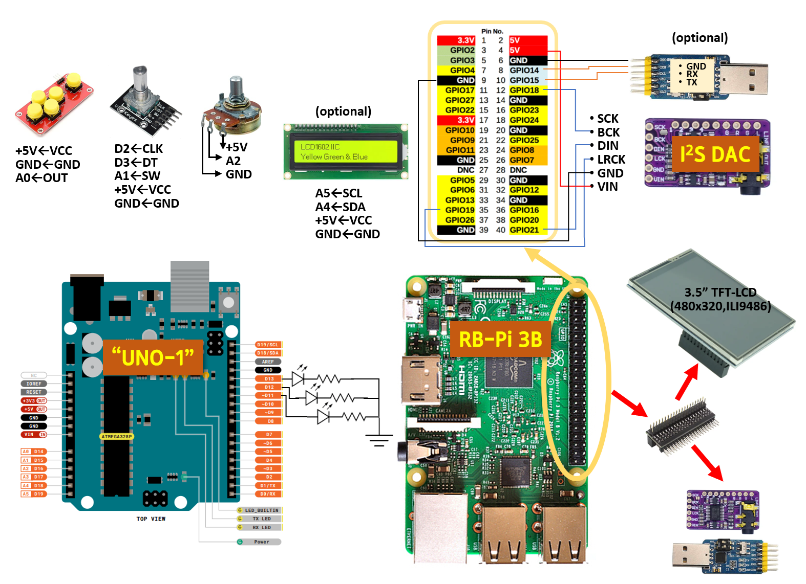

# Fluid Ardule

**Turn a Raspberry Pi and Arduino into a standalone MIDI sound module and musical instrument.**

> **Every feature added to Fluid Ardule should make it a better musical instrument—not a smaller DAW.**

Fluid Ardule is a modular DIY music workstation that combines Raspberry Pi–based audio synthesis with Arduino-powered hardware control.

Designed as a dedicated musical instrument rather than a general-purpose Linux computer, Fluid Ardule provides a self-contained environment for **FluidSynth**, **Yoshimi**, MIDI playback, media playback, Internet radio, Bluetooth audio reception, and external MIDI module integration. Its event-driven architecture emphasizes responsive operation, low CPU usage, and reliable live performance.

As of June 2026, the project had evolved into a mature Python application exceeding 10,000 lines of code, marking a significant milestone in its development. Current work focuses on reliability, seamless engine switching, and a hardware-oriented user experience.

---

## What does it do?

- Operate as a standalone MIDI sound module — simply connect a MIDI keyboard and play
- Support multiple synthesis engines, including **FluidSynth** (SoundFonts) and **Yoshimi**
- Browse and load SoundFont and Yoshimi presets by category
- Save and recall persistent **User Presets** across synthesis engines
- Support workstation-style **Combi** performance with layering and keyboard split
- Accept MIDI input from USB or DIN (via the optional **UNO-2** MIDI bridge)
- Play Standard MIDI Files and common audio formats (MP3, OGG, WAV, WMA, and more)
- Receive Bluetooth audio (A2DP) from phones and tablets
- Output audio through either an I2S DAC or a USB DAC
- Mirror live MIDI performance and MIDI file playback to external MIDI sound modules
- Automatically calibrate the 5-button analog keypad with EEPROM-persisted settings
- Control the entire system through a dedicated Arduino-based hardware interface (**UNO-1**)
- Provide a hardware-oriented workflow with quick-access menus, MIDI Panic, sound refresh, and context-aware navigation

> **Project status**
>
> Fluid Ardule is under active development. Current work focuses on improving live performance, engine transition reliability, Combi workflow, and seamless integration between FluidSynth and Yoshimi.
>
> See also: [`docs/combination-system-design.md`](docs/combination-system-design.md) — a proposed workstation-style Combination architecture based on User Presets, layering, and keyboard split.
>
> A major milestone was achieved in **260712b**, which re-established reliable restart-free Yoshimi live instrument loading through validated path-selection logic. Future changes should preserve this behavior unless a demonstrably more reliable implementation is available.

---

## System Overview

- **Raspberry Pi**: core system (synthesis, playback, control)
- **TFT-LCD**: dedicated UI display driven by the Python application (not a general-purpose system display)
- **UNO-1**: dedicated UI controller (buttons, encoder, potentiometer, LEDs, keypad calibration)
- (Optional) **UNO-2**: MIDI bridge for devices with 5-pin DIN only (keyboard controllers or external sound modules)

External MIDI output can also be handled directly via USB MIDI interfaces without UNO-2, which is often simpler and more stable.

[UNO-2](https://github.com/jeong0449/NanoArdule/tree/main/firmware/ardule_usb_midi_host) (`Ardule` MIDI Bridge or USB MIDI Host) is maintained as a separate project due to its strong independence, and is therefore omitted from the diagram above.

---

## 🎬 Demo

Previous demo:

---

## System Architecture

```mermaid
flowchart LR

    KBD1[USB MIDI Keyboard] -->|USB| UNO2[UNO-2<br/>MIDI Router / Bridge]
    KBD2[DIN MIDI Keyboard] --> UNO2

    KBD1 -->|USB direct<br/>raw MIDI| PI[Raspberry Pi]

    UNO2 -->|DIN MIDI| EXT[External MIDI Module]
    UNO2 -->|USB-serial| BRIDGE[uno-midi-bridge<br/>Python / C]

    BRIDGE -->|ALSA MIDI| PI

    BT[Phone / Tablet<br/>Bluetooth A2DP] -->|Bluetooth| PI

    PI --> FS[FluidSynth / Yoshimi / Player /<br/>Bluetooth Audio]

    PI --> TFT[TFT-LCD]

    CTRL[Buttons / Encoder / Potentiometer] --> UNO1[UNO-1<br/>UI Controller]
    UNO1 -->|Serial / Events| PI

    FS --> DAC[I2S DAC / USB Audio]
    DAC --> OUT[Audio Output]
```

The system is designed as a modular architecture separating UI control, MIDI routing, and synthesis engine for flexibility and scalability.

External MIDI modules can also be connected directly to the Raspberry Pi via USB MIDI interfaces, bypassing UNO-2.

→ See [architecture.md](architecture.md) for details.

---

## Hardware Layout

Click the diagram to enlarge.  
See [components.md](docs/components.md) for the parts list.

### UNO-1 Reset Stabilization Capacitor

Some Arduino UNO + I2C LCD combinations may occasionally display garbled characters during startup due to reset timing.

Adding a **10 µF electrolytic capacitor** between **RESET** and **GND** on **UNO-1** significantly improves startup reliability.

For background information and troubleshooting, see:

➡ **[LCD Garbled Characters During Startup](docs/troubleshooting/2026-05-29-lcd-garbled-characters.md)**

---

## External MIDI Integration

Fluid Ardule supports direct integration with external MIDI sound modules via USB MIDI interfaces.

Key features:

- Mirror mode: replicate live MIDI input and MIDI file playback to external devices
- Program Change (PC) transmission for external module control
- Port-aware selection for multi-port devices (e.g., SC-D70 Part A / B / MIDI)
- Automatic device detection — only connected devices are shown in the UI

This allows Fluid Ardule to function not only as a sound module,
but also as a flexible MIDI routing and control station for external hardware modules.

---

## Design Philosophy

### Event-Driven User Interface

Fluid Ardule is built around an event-driven user interface rather than a continuously refreshed graphical interface.

The TFT display is updated only when user interaction or meaningful hardware events require it. Expensive system information is refreshed on demand, while lightweight background monitoring is used selectively for hardware events that directly affect usability, such as USB media insertion and live MIDI connectivity.

This design significantly reduces CPU utilization while improving real-time audio stability, particularly during live performance and Yoshimi playback.

### Performance Without Sacrificing Usability

Performance optimization should never compromise the experience of using a musical instrument.

Fluid Ardule minimizes background activity wherever possible, but preserves lightweight monitoring for hardware events that users naturally expect to work immediately. Heavy system polling is avoided, while inexpensive state checks are allowed when they improve responsiveness without affecting audio performance.

Likewise, physical controls should behave like those of dedicated hardware instruments. Features such as soft takeover prevent abrupt parameter changes when hardware positions and internal states differ, allowing smooth and predictable interaction during live performance.

### Simplicity over Audio Middleware

Fluid Ardule intentionally uses direct ALSA audio paths instead of audio
middleware such as JACK, PulseAudio, or PipeWire.

While these frameworks provide powerful routing and desktop integration,
they also introduce additional complexity, latency, and recovery
scenarios that are unnecessary for the project's goals.

By keeping the runtime architecture simple and deterministic, Fluid
Ardule prioritizes predictable behavior, low latency, and reliable live
performance over maximum flexibility.

### Real-Time Safe Rendering

Fluid Ardule prioritizes audio performance over display updates.

Whenever possible, rendering work is deferred until it is actually needed, allowing the synthesis engine to receive maximum CPU time during playback and live performance.

As a result:

- Python CPU utilization is significantly reduced during normal operation.
- Audio glitches caused by excessive UI rendering are greatly reduced.
- Both `alsa_raw` and `alsa_seq` modes benefit from improved stability.
- The user interface remains responsive while avoiding unnecessary framebuffer updates.

This rendering model follows the philosophy of dedicated hardware synthesizers, where display updates are considered secondary to deterministic real-time audio processing.

The UI subsystem is also designed to tolerate temporary controller-side instability and recover gracefully without requiring SSH access whenever possible.

### Persistent Yoshimi Runtime

Fluid Ardule treats Yoshimi as a persistent synthesis engine rather than
a process that should be restarted whenever an instrument changes.

Whenever possible, instrument changes are performed through the running
Yoshimi CLI. This minimizes latency, avoids unnecessary audio
interruption, and preserves the responsive feel expected from a hardware
instrument.

To make reliable live loading possible, the instrument resolver always
prefers existing whitespace-free local patch paths before considering
the original factory locations. Original paths remain available only as
a fallback when a full restart is unavoidable.

This priority is intentional. Seemingly simpler path-selection logic can
silently disable live loading and reintroduce unnecessary Yoshimi
restarts.

---

## Installation / Build

The installation guide covers Raspberry Pi OS setup, required software, system services, audio configuration, networking, and Fluid Ardule startup.

👉 [Installation Guide](docs/installation.md)

Hardware construction remains a DIY process and should be adapted to the builder's enclosure, controls, DAC, and power-supply arrangement.

---

## Documentation

Additional technical notes are available:

- [System Architecture](architecture.md)
- [Components List](docs/components.md)
- [Installation Guide](docs/installation.md)
- [Combination System Design](docs/combination-system-design.md)
- [Power Distribution and Undervoltage Troubleshooting](docs/power-distribution.md)

Topics include:

- Raspberry Pi 3B power distribution
- USB Peripheral Power Injection Adapter
- Undervoltage diagnostics (`vcgencmd get_throttled`)
- Hardware reliability improvements

---

## Related Projects

- https://github.com/jeong0449/NanoArdule
- https://github.com/jeong0449/NanoArdule/tree/main/firmware/ardule_usb_midi_host
- https://github.com/jeong0449/uno-midi-bridge

---

## Naming

**Fluid Ardule** is a compound name combining:

- **Fluid** — referring to FluidSynth, the software synthesizer used in the system 
- **Ardule** — a coined term derived from *Arduino* and *module*, representing a modular Arduino-based hardware system  

Together, *Fluid Ardule* describes a hybrid MIDI sound module that integrates software synthesis with Arduino-based hardware control.

The name *Fluid Ardule* was chosen after considering alternatives such as *Fluid Canvas,* which was already in use.
