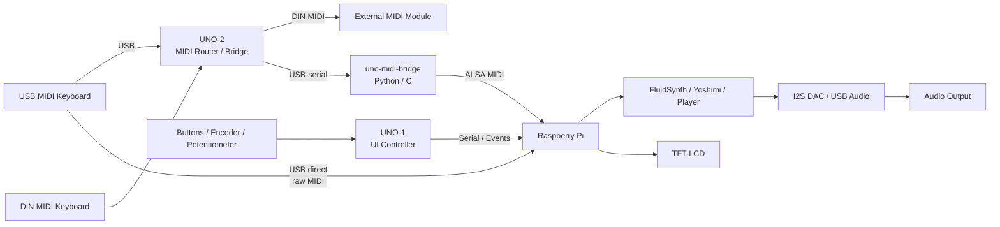

# Fluid Ardule

**Turn a Raspberry Pi and Arduino into a powerful standalone MIDI sound module.**

A modular DIY MIDI sound module combining Raspberry Pi synthesis with Arduino-based hardware control.

---

## What does it do?

- Act as a standalone MIDI sound module with instant playability — connect a keyboard and play immediately
- Support multiple sound engines including FluidSynth and Yoshimi
- Browse and load SoundFont presets by category
- Save and recall user-defined presets across different sound engines
- Control synthesis and playback parameters via dedicated hardware UI (UNO-1)
- Self-calibrating 5-button analog keypad with EEPROM-persisted ADC center values
- Accept MIDI input from USB or DIN (DIN I/O via UNO-2 MIDI bridge)
- Play MIDI files using FluidSynth
- Play audio files (MP3, OGG, WAV, WMA, and other common formats)
- Output audio via I2S DAC or USB DAC
- Mirror internal MIDI performance (live input and MIDI file playback) to external MIDI devices via USB MIDI interfaces
- Support external MIDI modules such as Roland SC-D70 over USB, including port-aware selection (e.g., Part A / Part B / MIDI)
- Dynamically display only connected MIDI devices (device-driven UI)
- Provide a hardware-oriented standalone instrument workflow with quick-access menus, MIDI panic, and persistent user presets

> 🚧 Advanced performance features such as layering, combination patches, keyboard split, deeper preset editing, and performance memory management are planned for future development.
>
> See also: [`docs/combination-system-design.md`](docs/combination-system-design.md)
> — a proposed workstation-style Combination architecture based on User Presets, layering, and keyboard split.

---

## System Overview

- **Raspberry Pi**: core system (synthesis, playback, control)
- **TFT-LCD**: dedicated UI display driven by the Python application (not a general-purpose system display)
- **UNO-1**: UI controller (buttons, encoder, potentiometer, LEDs)
- (Optional) **UNO-2**: MIDI bridge for devices with 5-pin DIN only (keyboard controllers or external sound modules)

External MIDI output can also be handled directly via USB MIDI interfaces without UNO-2, which is often simpler and more stable.

[UNO-2](https://github.com/jeong0449/NanoArdule/tree/main/firmware/ardule_usb_midi_host) (`Ardule` MIDI Bridge or USB MIDI Host) is maintained as a separate project due to its strong independence, and is therefore omitted from the diagram above.

---

## 🎬 Demo

---

## System Architecture

```mermaid
flowchart LR

    KBD1[USB MIDI Keyboard] -->|USB| UNO2[UNO-2<br/>MIDI Router / Bridge]
    KBD2[DIN MIDI Keyboard] --> UNO2

    KBD1 -->|USB direct<br/>raw MIDI| PI[Raspberry Pi]

    UNO2 -->|DIN MIDI| EXT[External MIDI Module]
    UNO2 -->|USB-serial| BRIDGE[uno-midi-bridge<br/>Python / C]

    BRIDGE -->|ALSA MIDI| PI

    PI --> FS[FluidSynth / Yoshimi / Player]
    PI --> TFT[TFT-LCD]

    CTRL[Buttons / Encoder / Potentiometer] --> UNO1[UNO-1<br/>UI Controller]
    UNO1 -->|Serial / Events| PI

    FS --> DAC[I2S DAC / USB Audio]
    DAC --> OUT[Audio Output]
```

The system is designed as a modular architecture separating UI control, MIDI routing, and synthesis engine for flexibility and scalability.

External MIDI modules can also be connected directly to the Raspberry Pi via USB MIDI interfaces, bypassing UNO-2.

→ See [architecture.md](architecture.md) for details.

---

## Hardware Layout

Click the diagram to enlarge.  
See [components.md](docs/components.md) for the parts list.

---

## External MIDI Integration

Fluid Ardule supports direct integration with external MIDI sound modules via USB MIDI interfaces.

Key features:

- Mirror mode: replicate live MIDI input and MIDI file playback to external devices
- Program Change (PC) transmission for external module control
- Port-aware selection for multi-port devices (e.g., SC-D70 Part A / B / MIDI)
- Automatic device detection — only connected devices are shown in the UI

This allows Fluid Ardule to function not only as a sound module,
but also as a flexible MIDI routing and control station for external hardware.

---

## Performance Notes

### Real-time Safe UI Rendering

To ensure stable real-time MIDI performance, TFT rendering is designed to minimize interference with audio processing.

- User-triggered updates (buttons, encoder) are rendered immediately
- Background screen updates are rate-limited (`RENDER_MIN_INTERVAL`)

This prevents frequent framebuffer updates from disrupting FluidSynth timing,
especially on resource-constrained systems like Raspberry Pi 3.

As a result:

- Audio glitches during live MIDI playback are significantly reduced
- Both `alsa_raw` and `alsa_seq` modes benefit from improved stability
- UI remains responsive when user interaction occurs

This approach aligns with dedicated hardware synthesizers, where display updates are deprioritized during active performance.

---

## Installation / Build

🚧 Work in progress  

An installation guide for OS and software setup is currently being prepared.  
Hardware assembly can be inferred from the system overview and components documentation.

👉 [Installation Guide](docs/installation.md)

---

## Related Projects

- https://github.com/jeong0449/NanoArdule
- https://github.com/jeong0449/NanoArdule/tree/main/firmware/ardule_usb_midi_host
- https://github.com/jeong0449/uno-midi-bridge

---

## Status

🚧 Work in progress  

This repository documents the evolving system architecture and integration of related components.

---

## Naming

**Fluid Ardule** is a compound name combining:

- **Fluid** — referring to FluidSynth, the software synthesizer used in the system 
- **Ardule** — a coined term derived from *Arduino* and *module*, representing a modular Arduino-based hardware system  

Together, *Fluid Ardule* describes a hybrid MIDI sound module that integrates software synthesis with Arduino-based hardware control.

The name *Fluid Ardule* was chosen after considering alternatives such as *Fluid Canvas,* which was already in use.
