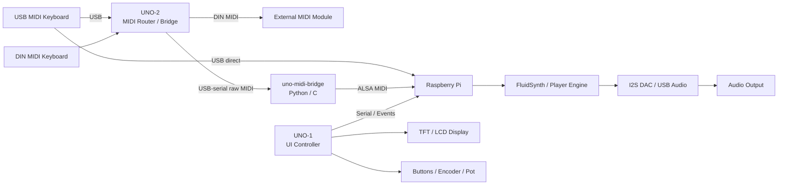

# FluidArdule Architecture

**Created:** 2026-04-17

## System Architecture

```mermaid
flowchart LR

    %% --- MIDI INPUT ---
    KBD1[USB MIDI Keyboard] -->|USB| UNO2[UNO-2<br/>MIDI Router / Bridge]
    KBD2[DIN MIDI Keyboard] --> UNO2

    %% direct path
    KBD1 -->|USB direct| PI[Raspberry Pi]

    %% --- MIDI ROUTING ---
    UNO2 -->|DIN MIDI| EXT[External MIDI Module]
    UNO2 -->|USB-serial raw MIDI| BRIDGE[uno-midi-bridge<br/>Python / C]

    %% --- PI ENGINE ---
    BRIDGE -->|ALSA MIDI| PI

    PI --> FS[FluidSynth / Player Engine]

    %% --- UI CONTROL (UNO-1) ---
    UNO1[UNO-1<br/>UI Controller] -->|Serial / Events| PI
    UNO1 --> LCD[TFT / LCD Display]
    UNO1 --> CTRL[Buttons / Encoder / Pot]

    %% --- AUDIO OUTPUT ---
    FS --> DAC[I2S DAC / USB Audio]
    DAC --> OUT[Audio Output]
```
