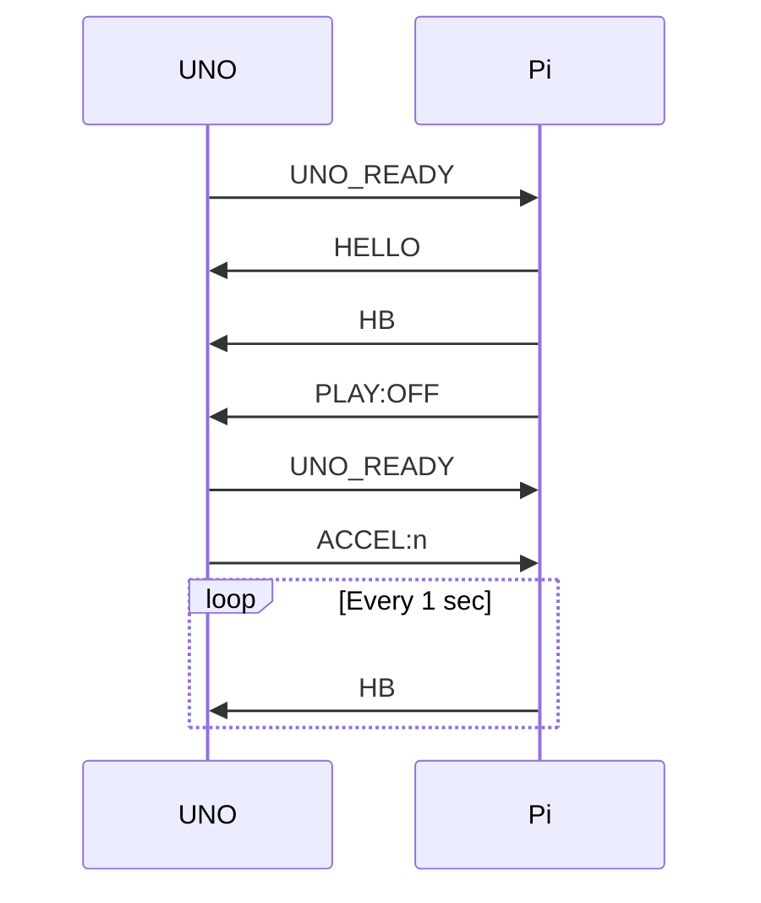
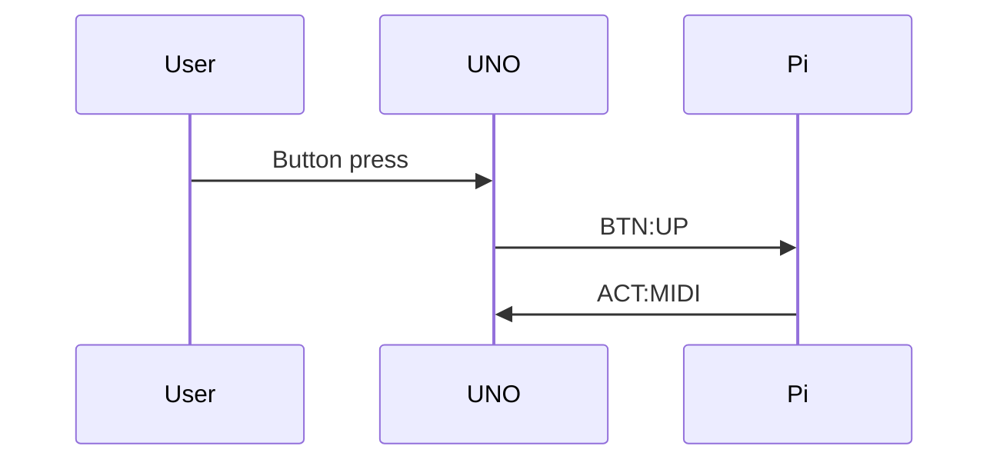
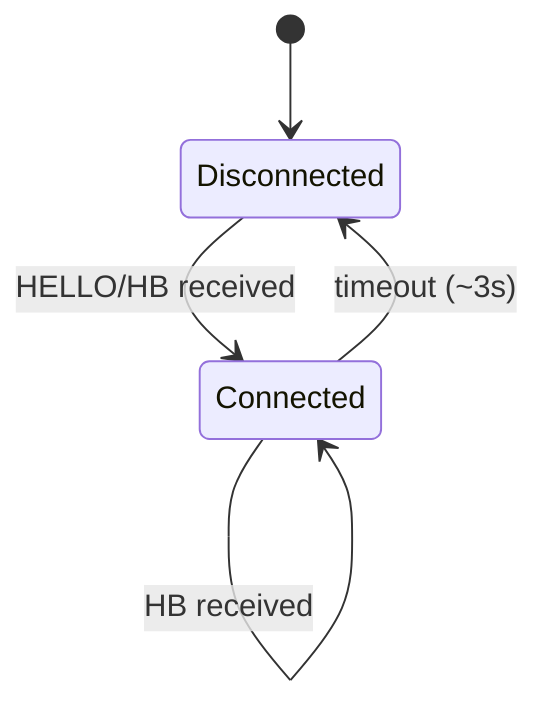

# UNO-1 ↔ Raspberry Pi Serial Protocol
*(Fluid Ardule Project)*

**Date: 2026-04-18**

---

## 1. Overview
UNO-1 and Raspberry Pi communicate via a **USB serial (CDC)** connection using a simple, human-readable **line-based ASCII protocol**.

- Baud rate: **115200**
- Encoding: ASCII
- Framing: **1 message per line (`\n`)**

---

## 2. Design Philosophy
- UNO-1 = **Input Controller**
- Pi = **System Controller**

UNO reports events, Pi determines system state.

---

## 3. Message Format
```
TYPE:VALUE
```
or:
```
UNO_READY
```

---

## 4. UNO → Pi Messages

### Boot
```
UNO_READY
```

### Buttons
```
BTN:LEFT / UP / DOWN / RIGHT / SEL
BTN:*_LP (long press)
BTN:ENC_PUSH
```

### Potentiometer
```
POT:0~1023
```

### Encoder
```
ENC:+N / -N
```

### Acceleration
```
ACCEL:1~3
```

---

## 5. Pi → UNO Messages

### Link
```
HELLO
```

### Heartbeat
```
HB
```

### MIDI Activity
```
ACT:MIDI
```

### Playback LED
```
PLAY:OFF / ON / BLINK
```

---

## 6. Connection Sequence



---

## 7. Event Flow Example



---

## 8. State Machine (UNO Link State)



---

## 9. Timing Rules
- Short press → sent on release
- Long press → sent immediately after threshold
- POT → threshold + interval filtering

---

## 10. LED Behavior
- LINK: connection state
- PLAY: playback state
- MIDI: pulse

---

## 11. Grammar

### UNO → Pi
```
uno-msg =
    "UNO_READY"
  / "BTN:" btn
  / "ENC:" int
  / "POT:" int
  / "ACCEL:" int
```

### Pi → UNO
```
pi-msg =
    "HELLO"
  / "HB"
  / "ACT:MIDI"
  / "PLAY:OFF"
  / "PLAY:ON"
  / "PLAY:BLINK"
```

---

## 12. Notes
- No ACK
- No checksum
- Debug-friendly ASCII protocol

---

## 13. Summary
Minimal and robust serial protocol for MIDI UI control.

---

*Fluid Ardule Project*
