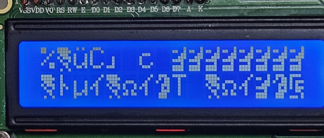

# LCD Garbled Characters During Startup and Service Restart

**Date:** 2026-05-29
**Project:** Fluid Ardule
**Component:** UNO-1 / I2C LCD
**Status:** Improved (under observation)

---

# Summary

Rare cases of garbled characters ("alien text") were observed on the UNO-1 I2C LCD.
The problem appeared intermittently during startup and occasionally during Raspberry Pi
service restart or serial link establishment.

<a href="../../images/2026-05-29-lcd-garbled-display.jpg">
  
</a>

*Figure 1. Garbled LCD characters observed during startup.*

Investigation showed that the problem was unlikely to be a simple LCD hardware fault.
Evidence pointed instead toward startup timing, reset behavior, and LCD initialization
sequencing.

A combination of hardware and firmware improvements greatly reduced the occurrence
of the problem.

---

# Symptoms

Observed symptoms included:

- Random corrupted LCD characters
- Unreadable status messages
- LCD displaying symbols resembling "alien text"
- Recovery only after reset or power cycling

The issue was intermittent and difficult to reproduce consistently.

---

# Initial Hypotheses

Several possible causes were considered:

1. LCD module defect
2. I2C communication errors
3. Serial communication interference
4. Power supply noise
5. Startup timing issues
6. LCD initialization sequence problems

At first, serial communication between Raspberry Pi and UNO-1 appeared suspicious because
the problem often occurred around service restart events.

---

# Important Observation

A key observation changed the direction of the investigation.

Garbled characters were occasionally observed immediately after power-up, before normal
serial communication with the Raspberry Pi had begun.

This weakened the theory that serial traffic alone was responsible.

Attention shifted toward:

- Startup timing
- Reset release timing
- LCD controller initialization

---

# Existing Firmware Behavior

During startup:

```cpp
lcd.init();
lcd.backlight();
lcd.clear();
```

The LCD controller was fully initialized.

Later, when Raspberry Pi established a serial connection, display text was updated but
the LCD controller itself was not reinitialized.

Effectively two different startup paths existed.

## Cold Start

Power On

↓

LCD initialization

↓

Normal operation

## Pi Link Establishment

HELLO received

↓

Display text updated

↓

LCD controller reused

This suggested that a controller entering an unstable state during startup might remain
in that state indefinitely.

---

# Hardware Experiment

A 10 µF electrolytic capacitor was added between:

- RESET (+)
- GND (-)

on UNO-1.

Purpose:

- Delay RESET release slightly
- Allow LCD and PCF8574 circuitry to stabilize
- Improve initialization timing

Observed result:

- Significant reduction in LCD corruption
- Improved cold-start reliability

Subsequent testing showed that removing the capacitor caused the garbled-character problem to reappear, even when LCD reinitialization on HELLO reception remained enabled.

---

# Interpretation

The capacitor does not act as a power-supply filter.

Instead, it modifies reset timing.

Possible sequence:

Power On

↓

LCD subsystem stabilizes

↓

RESET released

↓

lcd.init()

↓

Normal operation

This explanation matched observations better than theories involving LCD hardware failure.

---

# Unexpected Side Effect

Further testing revealed an important consequence.

With the capacitor connected:

- Sketch uploads occasionally failed
- Arduino IDE reported synchronization errors
- Auto-reset behavior became unreliable

Example:

```text
not in sync: resp=0x55
```

Investigation showed that the same capacitor helping startup stability was also
interfering with the Arduino auto-reset mechanism used during sketch upload.

---

# Design Revision

The capacitor was originally installed as a soldered modification.

This proved inconvenient because firmware uploads became difficult.

The design was revised:

Normal operation:
- Capacitor installed

Firmware upload:
- Capacitor temporarily removed

The capacitor is now used in a removable configuration connected through the UNO-1
shield header.

This preserves startup stability while maintaining convenient firmware development.

---

# Firmware Improvement

A firmware mitigation was also implemented to complement the hardware startup stabilization measures.

The original implementation was introduced on **2026-05-29** in commit **0380f4a**:

```text
0380f4a
Add LCD recovery on first HELLO
```

When Raspberry Pi establishes its first successful HELLO link, the LCD is now reinitialized.

Conceptually:

```cpp
if (!wasLinked)
{
    lcd.init();
    lcd.backlight();
    lcd.clear();
}
```

Purpose:

- Re-synchronize LCD controller state
- Improve robustness during service restart events
- Provide an additional recovery path beyond RESET timing stabilization

Subsequent testing showed that this firmware mechanism alone is insufficient to prevent the startup garbling issue. The RESET-GND 10 µF capacitor remains the primary mitigation, while LCD reinitialization on HELLO acts as a secondary recovery layer.

This creates a software recovery layer in addition to the hardware stabilization layer.

> [!NOTE]
> This document refers to the original LCD recovery mechanism introduced in commit `0380f4a` on 2026-05-29.
> The exact implementation may evolve in later firmware revisions, but the troubleshooting results described here are based on that original mitigation.

---

# Verification Testing

Repeated service restart testing was performed.

Results:

| Test | Result |
|--------|--------|
| Service restart cycles | ~25 |
| LCD garbled characters | Not observed |
| Pi serial reconnection | Successful |
| LCD operation | Normal |

While the original problem was already rare, repeated testing showed a substantial
improvement.

---

# Current Assessment

Current evidence suggests the root cause is most likely related to:

- Startup timing
- RESET release timing
- LCD initialization sequencing

rather than:

- LCD hardware defects
- Application-level firmware bugs

The most effective mitigation currently appears to be:

1. RESET-GND 10 µF startup stabilization capacitor
2. LCD reinitialization after first HELLO message

Experimental evidence indicates that the startup stabilization capacitor plays the primary role. Removing the capacitor caused the problem to return, whereas the HELLO-triggered LCD reinitialization alone did not fully prevent the issue.

---

# Lessons Learned

This issue demonstrated the difference between implementing new functionality and
improving system reliability.

The LCD itself was not defective.

Instead, a combination of startup timing, reset behavior, and initialization sequencing
produced a rare but disruptive fault.

A small hardware change and a simple firmware recovery mechanism together provided a
substantial increase in reliability.

---

# Future Monitoring

Continue observing:

- Cold starts
- Service restarts
- Long-term operation

If the issue reappears, additional logging and startup instrumentation may be required.

For now, the problem is considered largely mitigated and remains under observation.
