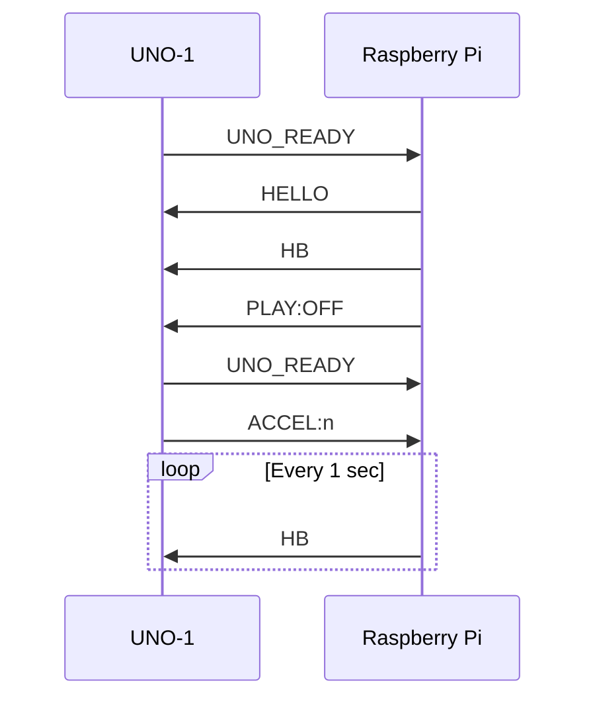
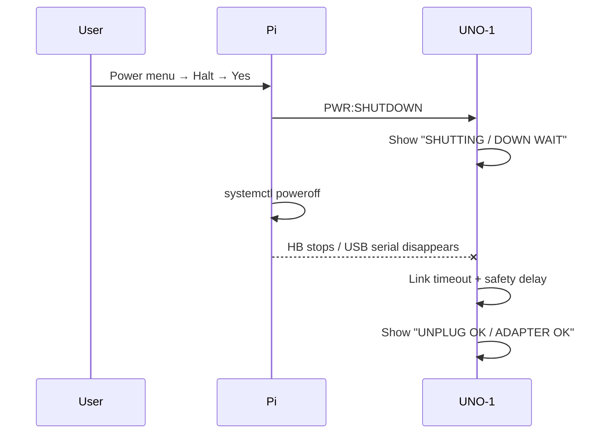
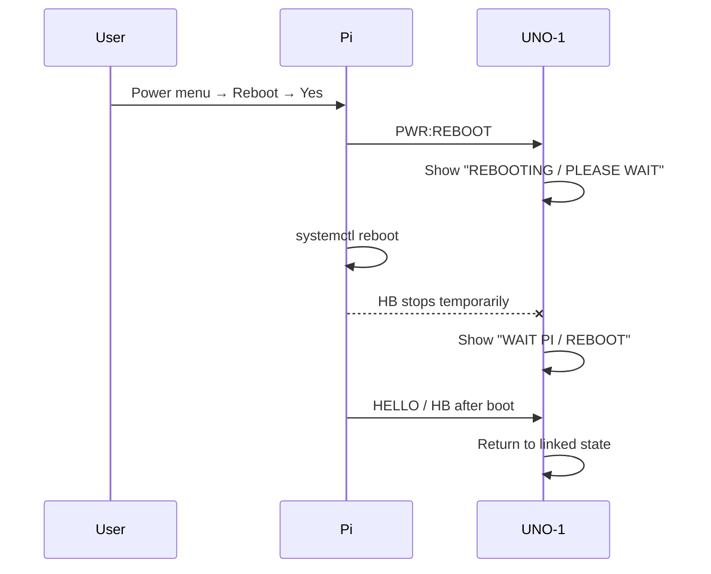
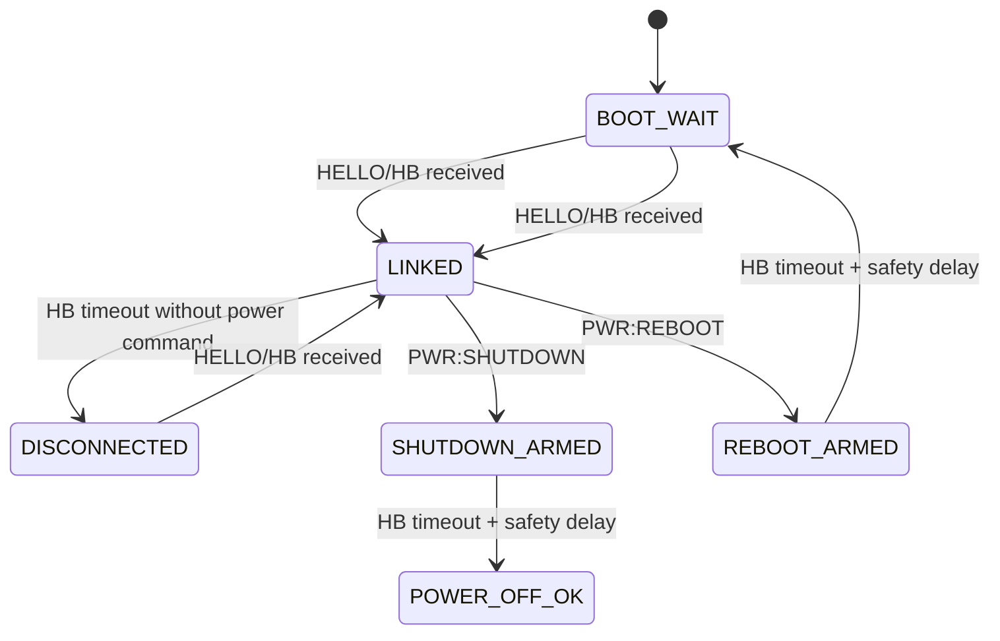

# UNO-1 ↔ Raspberry Pi Serial Protocol
*(Fluid Ardule Project)*

**Version: 20260428a**  
**Updated: 2026-04-28**

---

## 1. Overview

UNO-1 and Raspberry Pi communicate via a USB serial (CDC) connection using a simple, human-readable, line-based ASCII protocol.

- Baud rate: **115200**
- Encoding: **ASCII**
- Framing: **1 message per line (`\n`)**
- Direction model:
  - **UNO-1 → Pi**: input events and local controller state
  - **Pi → UNO-1**: link, heartbeat, LED state, power-state notification

---

## 2. Design Philosophy

- UNO-1 is the **local input and status controller**.
- Raspberry Pi is the **system controller**.
- UNO-1 must not infer “safe to unplug” merely from USB disconnection.
- The “adapter may be unplugged” message is shown only when all of the following are true:
  1. UNO-1 has already established a live Pi link.
  2. Pi explicitly sent `PWR:SHUTDOWN`.
  3. The heartbeat/link subsequently disappeared.
  4. A safety delay has elapsed.

This prevents false positives during boot waiting, Pi crash, USB cable removal, or firmware-upload replugging.

---

## 3. Message Format

Most messages use:

```text
TYPE:VALUE
```

Some messages are standalone tokens:

```text
UNO_READY
HELLO
HB
```

---

## 4. UNO-1 → Pi Messages

### Boot / readiness

```text
UNO_READY
```

UNO-1 sends this at boot and periodically while running.

### Buttons

```text
BTN:LEFT
BTN:UP
BTN:DOWN
BTN:RIGHT
BTN:SEL
BTN:ENC_PUSH
```

Long press:

```text
BTN:LEFT_LP
BTN:UP_LP
BTN:DOWN_LP
BTN:RIGHT_LP
BTN:SEL_LP
```

### Encoder

```text
ENC:+N
ENC:-N
```

`N` is the acceleration-adjusted step magnitude generated by UNO-1.

### Potentiometer

```text
POT:0~1023
```

### Encoder acceleration profile

```text
ACCEL:1
ACCEL:2
ACCEL:3
```

---

## 5. Pi → UNO-1 Messages

### Link establishment

```text
HELLO
```

Pi sends this after opening the serial port.

### Heartbeat

```text
HB
```

Pi sends this periodically. In `launch_fluidardule.py`, the configured interval is:

```python
SERIAL_HEARTBEAT_INTERVAL_SEC = 1.0
```

UNO-1 treats the link as stale after approximately:

```cpp
LINK_TIMEOUT_MS = 3000
```

### MIDI activity LED pulse

```text
ACT:MIDI
```

### Playback LED state

```text
PLAY:OFF
PLAY:ON
PLAY:BLINK
```

### Power-state notification

```text
PWR:SHUTDOWN
PWR:REBOOT
```

`PWR:SHUTDOWN` is sent only when shutdown is initiated from the Fluid Ardule UI power menu. After receiving this while already linked, UNO-1 enters shutdown-armed state.

`PWR:REBOOT` is sent only when reboot is initiated from the Fluid Ardule UI power menu. Reboot does **not** lead to a safe-unplug message.

Legacy aliases accepted by UNO-1 for compatibility:

```text
SHUTDOWN
REBOOT
```

---

## 6. Connection Sequence



---

## 7. UI-Initiated Shutdown Sequence



---

## 8. Reboot Sequence



---

## 9. UNO-1 Link / Power State Machine



---

## 10. Safety Rules

- `HB` timeout alone is **not** a safe-off condition.
- USB unplug/replug without `PWR:SHUTDOWN` is shown as link loss / wait state, not safe-off.
- `PWR:SHUTDOWN` is accepted only when UNO-1 is already linked to Pi.
- `PWR:REBOOT` never produces an adapter-unplug message.
- SSH/manual shutdown is intentionally outside this smart-safe display path unless the main UI sends the power notification first.

---

## 11. Grammar

### UNO-1 → Pi

```text
uno-msg =
    "UNO_READY"
  / "BTN:" btn
  / "ENC:" int
  / "POT:" int
  / "ACCEL:" int
```

### Pi → UNO-1

```text
pi-msg =
    "HELLO"
  / "HB"
  / "ACT:MIDI"
  / "PLAY:OFF"
  / "PLAY:ON"
  / "PLAY:BLINK"
  / "PWR:SHUTDOWN"
  / "PWR:REBOOT"
```

---

## 12. Summary

Version 20260428a extends the existing UNO-1/Pi serial protocol with explicit UI-initiated power-state messages. UNO-1 now distinguishes normal link loss from a deliberate shutdown and shows the adapter-removal message only after a confirmed shutdown path.

---

*Fluid Ardule Project*
